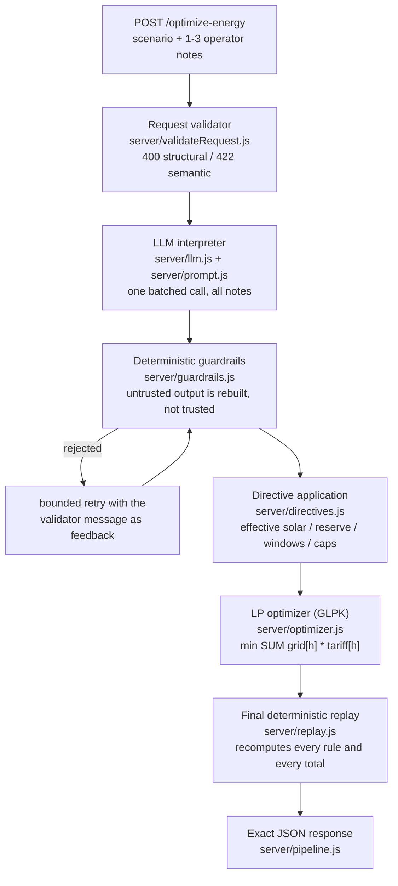

# GridWise — LLM-Assisted Smart Campus Energy Optimization

BUP CSE Fest 2026 · Hackathon Online Preliminary · **Deployed Public HTTP API**

One Node.js/Express service that reads a 24-hour campus energy scenario plus 1–3 natural-language
operator notes, has a language model interpret **every** note into a structured directive, validates
that interpretation with deterministic guardrails, feeds the validated directives into a linear-
programming optimizer, independently replays the resulting schedule, and returns the exact JSON
contract defined in `project.md`.

**Live service: <https://bup-preliminary-hackathon.vercel.app>**

```bash
curl https://bup-preliminary-hackathon.vercel.app/health
# {"status":"ok"}
```

| | |
|---|---|
| Live base URL | `https://bup-preliminary-hackathon.vercel.app` |
| Health endpoint | `GET /health` → `200 {"status":"ok"}` |
| Primary endpoint | `POST /optimize-energy` |
| Default port | `8080` (binds `0.0.0.0`) |
| Stack | Node.js ≥ 22.9 · Express 5 · React 18 (demo console) · MongoDB Atlas (optional) |
| LLM provider | Groq (default), OpenAI, or any OpenAI-compatible endpoint |
| Model in use | `openai/gpt-oss-120b` on Groq (`GROQ_MODEL` / `LLM_MODEL`) |
| Optimizer | GLPK simplex via [`glpk.js`](https://www.npmjs.com/package/glpk.js) |

---

## 1. Architecture



### What each stage is responsible for

**The LLM (`server/llm.js`, `server/prompt.js`) — mandatory, in the real path.**
One batched chat completion converts all operator notes into `directive_interpretation` entries.
This is the *only* component that reads natural language: there is no keyword interpreter, no phrase
table, and no fallback that guesses a directive. The model handles paraphrase, relative time
expressions, percentage-to-fraction conversion, percentage-of-capacity conversion, and distractor
notes. Its structured output is what ultimately becomes the optimizer's constraints — the model is
never limited to cosmetic text such as `plan_summary` (which is generated deterministically).

**Deterministic guardrails (`server/guardrails.js`).**
Model output is untrusted structured data. Every entry is checked for: supported directive type,
one entry per note, exact `note_index` in ascending order (which enforces no missing/duplicate
mappings), `applies` semantics (`no_op` ⇒ `applies:false` + `structured_adjustment:null`, every other
type ⇒ `applies:true` + a non-null adjustment), exact adjustment shape, hours being unique ascending
integers in `0..23`, solar `factor ∈ [0,1]`, reserve finite/non-negative/≤ capacity, grid cap
finite/non-negative. Entries are **rebuilt from validated parts**, so a model-invented extra key can
never reach the response or the optimizer. A rejection is retried once with the validator's own
message as feedback; if it still fails the request fails in a controlled way — a failed note is never
silently downgraded to `no_op` and an invalid directive is never repaired by guessing.

**Directive application (`server/directives.js`).**
Validated directives become per-hour constraints *before* optimization: `effectiveSolar`,
`effectiveMinimum`, `chargeAllowed`, `dischargeAllowed`, `gridCap`. Overlaps combine conservatively —
strictest remaining solar availability, `max` of reserves, `min` of grid caps, and any prohibition
wins.

**Optimizer (`server/optimizer.js`).**
A linear program over 24 hours with variables `grid[h]`, `solar_used[h]`, `charge[h]`,
`discharge[h]`, `energy_after[h]`, solved with GLPK. Constraints: hourly energy balance
(`grid + solar_used + discharge = demand + charge`), battery state transition, battery bounds
(`effective_minimum[h] ≤ energy_after[h] ≤ capacity`), charge/discharge rate limits, directive
windows and caps, and `energy_after[23] = initial_energy_kwh`. Objective: `min Σ grid[h] · tariff[h]`.
No grid export exists in the model. The plan is then rebuilt deterministically from the net battery
flow, which removes simultaneous charge/discharge degeneracy and keeps the energy balance exact.

**Final replay validator (`server/replay.js`).**
The solver is never trusted. The returned `hourly_plan` is replayed hour by hour against the
*directives* — effective solar recomputed from the `solar_reduction` entries, battery transitions,
capacity and reserve bounds, rate limits, no-charge/no-discharge windows, grid caps, the balance
equation, end-of-day neutrality — and `total_grid_kwh`, `total_cost_bdt`, `peak_grid_kwh` are
recalculated from the plan. Absolute tolerance `0.01 kWh / 0.01 BDT`. A plan that fails replay is
never returned as a success.

---

## 2. Quickstart (clean machine)

Requires **Node.js ≥ 22.9** (the npm scripts use `--env-file-if-exists`) and a model API key.

```bash
git clone <this-repository>
cd BUP_Preli
npm install

cp .env.example .env          # Windows: copy .env.example .env
# edit .env and set GROQ_API_KEY=<your key>

npm start
```

Startup prints the provider/model and the bound address. The React console is served at the same
address (`/`). The port comes from `PORT`; everything below uses the default `8080`, so substitute
your own value if you set a different one (the bundled `.env` uses `5000`).

`npm start` loads `.env` automatically if it exists (`node --env-file-if-exists=.env`). Real
environment variables always win over the file, so Docker and hosted platforms keep working without
one.

### Health check

```bash
curl http://localhost:8080/health
# {"status":"ok"}
```

### Optimize a scenario

Against the live service, substitute `https://bup-preliminary-hackathon.vercel.app` for
`http://localhost:8080` in the command below.

```bash
curl -s -X POST http://localhost:8080/optimize-energy \
  -H 'content-type: application/json' \
  -d '{
    "scenario_id": "GRID-101",
    "operator_notes": [
      "Facilities will wash the rooftop solar panels from noon until 2 PM. During cleaning, usable solar should be treated as roughly 25% of the forecast.",
      "The sports office moved next month'"'"'s registration deadline."
    ],
    "hours": [
      {"hour":0,"demand_kwh":90,"solar_kwh":0,"tariff_bdt_per_kwh":9},
      {"hour":1,"demand_kwh":85,"solar_kwh":0,"tariff_bdt_per_kwh":9},
      {"hour":2,"demand_kwh":80,"solar_kwh":0,"tariff_bdt_per_kwh":9},
      {"hour":3,"demand_kwh":80,"solar_kwh":0,"tariff_bdt_per_kwh":9},
      {"hour":4,"demand_kwh":85,"solar_kwh":0,"tariff_bdt_per_kwh":9},
      {"hour":5,"demand_kwh":95,"solar_kwh":0,"tariff_bdt_per_kwh":9},
      {"hour":6,"demand_kwh":110,"solar_kwh":5,"tariff_bdt_per_kwh":11},
      {"hour":7,"demand_kwh":130,"solar_kwh":20,"tariff_bdt_per_kwh":11},
      {"hour":8,"demand_kwh":150,"solar_kwh":45,"tariff_bdt_per_kwh":13},
      {"hour":9,"demand_kwh":165,"solar_kwh":70,"tariff_bdt_per_kwh":13},
      {"hour":10,"demand_kwh":175,"solar_kwh":95,"tariff_bdt_per_kwh":15},
      {"hour":11,"demand_kwh":180,"solar_kwh":110,"tariff_bdt_per_kwh":15},
      {"hour":12,"demand_kwh":185,"solar_kwh":120,"tariff_bdt_per_kwh":17},
      {"hour":13,"demand_kwh":185,"solar_kwh":115,"tariff_bdt_per_kwh":17},
      {"hour":14,"demand_kwh":180,"solar_kwh":100,"tariff_bdt_per_kwh":17},
      {"hour":15,"demand_kwh":175,"solar_kwh":80,"tariff_bdt_per_kwh":15},
      {"hour":16,"demand_kwh":170,"solar_kwh":50,"tariff_bdt_per_kwh":15},
      {"hour":17,"demand_kwh":175,"solar_kwh":20,"tariff_bdt_per_kwh":19},
      {"hour":18,"demand_kwh":185,"solar_kwh":0,"tariff_bdt_per_kwh":21},
      {"hour":19,"demand_kwh":190,"solar_kwh":0,"tariff_bdt_per_kwh":21},
      {"hour":20,"demand_kwh":180,"solar_kwh":0,"tariff_bdt_per_kwh":19},
      {"hour":21,"demand_kwh":160,"solar_kwh":0,"tariff_bdt_per_kwh":15},
      {"hour":22,"demand_kwh":130,"solar_kwh":0,"tariff_bdt_per_kwh":11},
      {"hour":23,"demand_kwh":105,"solar_kwh":0,"tariff_bdt_per_kwh":9}
    ],
    "battery": {
      "capacity_kwh": 220,
      "initial_energy_kwh": 110,
      "minimum_energy_kwh": 40,
      "max_charge_kwh_per_hour": 50,
      "max_discharge_kwh_per_hour": 50
    }
  }'
```

Response shape (abridged):

```json
{
  "scenario_id": "GRID-101",
  "directive_interpretation": [
    { "note_index": 0, "applies": true, "directive_type": "solar_reduction",
      "structured_adjustment": { "hours": [12, 13], "factor": 0.25 },
      "explanation": "Usable solar is reduced to 25% during the cleaning window." },
    { "note_index": 1, "applies": false, "directive_type": "no_op",
      "structured_adjustment": null,
      "explanation": "This note does not affect today's 24-hour energy schedule." }
  ],
  "hourly_plan": [
    { "hour": 0, "grid_kwh": 40, "solar_used_kwh": 0,
      "battery_action": "discharge", "battery_kwh": 50, "battery_energy_after_kwh": 60 }
    // ... 23 more, one per hour
  ],
  "total_grid_kwh": 2791.25,
  "total_cost_bdt": 38581.25,
  "peak_grid_kwh": 170,
  "plan_summary": "Applied usable solar cut to 25% at 12:00, 13:00. Ignored 1 note unrelated to today's schedule. ... Total grid import 2791.25 kWh, peak 170.00 kWh, cost 38581.25 BDT."
}
```

Error responses are minimal and controlled — `{"error": "<short message>"}` with no stack traces,
provider bodies, or configuration values:

| Status | When |
|---|---|
| `400` | Malformed JSON or structurally invalid request |
| `422` | Well-formed but semantically contradictory (negative demand, reserve above capacity, initial energy below the base minimum, …) |
| `500` | Controlled internal failure (provider unavailable, interpretation rejected by guardrails, infeasible model, failed replay) |

---

## 3. Testing

```bash
npm test          # 58 tests: validation, guardrails, directive application,
                  # optimizer, replay mutation tests, API integration, public samples
```

`npm test` requires **no API key** — the model completion is injected as a stub so the guardrail,
optimizer and replay paths are exercised deterministically.

### Public sample cases

The organizer's `BUP_CSE_FEST_2026_Preli_Public_Sample_Cases.json` ships in this repository, so no
file needs to be placed before running the checks. Two levels:

```bash
# 1. Offline (part of npm test): each case's published ground-truth directives are fed into
#    the optimizer and the plan is replayed. Proves the scheduling half without spending tokens.
npm test

# 2. End-to-end against a running service, including the real model call:
npm start                                             # in one terminal
npm run samples                                       # in another (defaults to http://localhost:8080)
node scripts/run-public-samples.js https://bup-preliminary-hackathon.vercel.app
```

The runner posts each case, compares `directive_interpretation` against the published ground truth
(machine-checkable fields only — free-text `explanation` wording is not matched), then replays the
returned `hourly_plan` against that ground truth exactly as the judge does, recomputes the three
totals, and prints per-case cost quality plus p95 latency. It exits non-zero on any failure.

Measured result on `openai/gpt-oss-120b` via Groq: **10/10 cases pass, 100% cost quality** on every
run. Every directive was interpreted correctly (hours, factors, percentage-of-capacity conversion,
distractors → `no_op`) and the optimizer reached the organizer's reference optimal cost on every case.

Latency is dominated by the provider and by free-tier throttling, so it varies run to run.
Three real-provider runs of the full pack measured **p95 2.5 s / 4.7 s / 8.4 s**. Individual
un-throttled requests land at 0.7–2.9 s; the slow tail is entirely `429` back-off waiting out the
8,000 tokens/minute cap, not compute — validation, LP solve and replay total ≈5 ms per request.
On an unthrottled key p95 should sit near the un-throttled request range; **that is an expectation,
not a measurement.** Re-measure on the deployment with `npm run benchmark` before relying on it.

Nine additional paraphrases that appear nowhere in the public pack — "down by three quarters",
"a quarter of the pack's capacity", "between 5 and 7 in the evening", "the two hours starting at
6 PM", "from 2 until 5" — were also interpreted correctly, 9/9.

### Extended 200-case stress suite

Ten public cases are not enough to trust a pipeline against hidden inputs, so this repository also
carries a **self-generated** 200-scenario suite. **These are our own cases, not organizer material** —
`scripts/generate-200-sample-cases.js` builds them, and the organizer's ten remain untouched in
`BUP_CSE_FEST_2026_Preli_Public_Sample_Cases.json`.

| Category | Cases | What it stresses |
|---|---:|---|
| OFFICIAL | 10 | the organizer's published cases |
| GOOD | 50 | ordinary directive mixes across varied demand, solar, tariff and battery profiles |
| BAD | 70 | awkward phrasings, distractors, unit and percentage traps |
| WORST | 50 | tight reserves, hard caps, near-infeasible combinations |
| EDGE | 20 | boundary windows and natural-language traps (midnight wrap, single-hour windows) |

```bash
node scripts/run-200-samples.js https://<base-url>   # run the suite
npm run test:200                                     # run it and write the report files
```

Latest full run against the live deployment — `test/200-sample-test-results.md` has the per-case
table, and `test/200-sample-test-results.json` the raw data:

| | |
|---|---|
| Pass rate | **200 / 200 (100%)** |
| Average cost quality | **100%** |
| Median / p95 / max latency | 1488 ms / 4439 ms / 23755 ms |

Every returned plan was replayed against its case's ground-truth directives before being counted a
pass. The 23.8 s maximum is a single request that waited out a provider rate limit — inside the 30 s
judge timeout, and the reason the API key pool described in §4 exists.

### Live endpoint suite

`test/live-api.test.js` exercises a deployed service. It is **opt-in** and skips by default so that
`npm test` never depends on the network or a provider key:

```bash
BASE_URL=https://bup-preliminary-hackathon.vercel.app npm test
```

### Latency benchmark

```bash
node scripts/benchmark.js http://localhost:8080 20
```

Reports min/median/p95/max. Run it against the real deployment: numbers from a stubbed model are not
representative, because end-to-end latency is dominated by the provider call.

---

## 4. Configuration

| Variable | Required | Default | Purpose |
|---|---|---|---|
| `PORT` | no | `8080` | HTTP port; the service always binds `0.0.0.0` |
| `LLM_PROVIDER` | no | `groq` | `groq` \| `openai` \| `openai_compatible` |
| `GROQ_API_KEY` | **yes** (groq) | — | Groq credential. One key, or several comma-separated — see the key pool below |
| `GROQ_MODEL` | no | `openai/gpt-oss-120b` | Groq model id |
| `OPENAI_API_KEY` / `OPENAI_MODEL` | for `openai` | `gpt-4o-mini` | OpenAI credential/model |
| `LLM_BASE_URL` / `LLM_API_KEY` / `LLM_MODEL` | for `openai_compatible` | — | Any other OpenAI-compatible endpoint (Together, OpenRouter, vLLM, Ollama, …) |
| `LLM_TIMEOUT_MS` | no | `9000` | Per-attempt provider timeout |
| `LLM_MAX_ATTEMPTS` | no | `2` | Total attempts, including the guardrail-feedback repair |
| `LLM_BUDGET_MS` | no | `25000` | Ceiling for the whole interpretation step, including `429` back-off waits |
| `MONGODB_URI` | no | — | MongoDB Atlas SRV string; unset disables history entirely |
| `MONGODB_DB` | no | `gridwise` | Database name for the history collection |

All three provider modes speak the OpenAI chat-completions dialect, so switching providers is an
environment change only. No key, model id, or endpoint is hard-coded anywhere in the source.

### API key pool

The provider key variable accepts a comma-separated list:

```bash
GROQ_API_KEY=gsk_one,gsk_two,gsk_three
```

Requests round-robin across the pool, and a key that returns `429` is parked until its own
`Retry-After` elapses rather than retried. N free-tier keys therefore behave like roughly N times
the per-minute token budget of one — with Groq's 8,000 TPM free tier, five keys give ≈40,000 TPM.
A key that returns `401`/`403` is parked for five minutes, so one revoked or mistyped key cannot
fail every request. Only when every key is cooling down does the pool wait, and only inside
`LLM_BUDGET_MS`. Keys are never logged; diagnostics refer to them by position.

State is per process, so on serverless each instance keeps its own cooldowns. That still spreads
load (each process starts at a random offset in the pool) but does not coordinate across instances.

### MongoDB Atlas (optional)

MongoDB is supporting infrastructure for the MERN architecture, not a challenge requirement, and it is
deliberately kept off the judge path. With `MONGODB_URI` set, each completed request appends a
sanitized run record (scenario id, notes, interpreted directives, totals, duration, model id) to the
`runs` collection, and `GET /api/runs` returns the latest 20 for the demo console.

1. Create a free Atlas cluster, then **Database Access** → add a user.
2. **Network Access** → allow the deployment's egress IP (or `0.0.0.0/0` for a hackathon demo).
3. **Connect → Drivers** → copy the SRV string into `MONGODB_URI`:
   `mongodb+srv://<user>:<password>@<cluster>.mongodb.net/?retryWrites=true&w=majority`

If the variable is unset, or Atlas is unreachable, the service logs one warning and behaves
identically: `/health` and `/optimize-energy` never touch the database, and writes are
fire-and-forget after the response has already been sent.

---

## 5. Docker fallback

```bash
docker build -t gridwise:1.0.0 .
docker run --rm -p 8080:8080 -e GROQ_API_KEY=<your key> gridwise:1.0.0
curl http://localhost:8080/health          # {"status":"ok"}
```

Registry image (published for the judges):

```bash
docker pull <REGISTRY>/<NAMESPACE>/gridwise:1.0.0
docker run --rm -p 8080:8080 -e GROQ_API_KEY=<your key> <REGISTRY>/<NAMESPACE>/gridwise:1.0.0
```

* Exposed port: `8080`. The process binds `0.0.0.0`.
* Required at runtime: `GROQ_API_KEY` (or the equivalent variable for another provider).
* Optional at runtime: `PORT`, `GROQ_MODEL`, `LLM_*`, `MONGODB_URI`, `MONGODB_DB`.
* No secrets are baked into the image — every credential is supplied with `-e` / `--env-file`.
* Runs as the non-root `node` user and ships a `HEALTHCHECK` that polls `/health`.

---

## 6. Vercel deployment

`api/index.js` + `vercel.json` adapt the same Express app to Vercel's serverless runtime — no
pipeline code changes. Import the repo with the **Other** framework preset, leave Root Directory at
the repository root, and add `GROQ_API_KEY` (plus `LLM_MODEL`) as environment variables.

`vercel.json` sets `maxDuration: 60` so a `429` back-off can still finish inside `LLM_BUDGET_MS`. If
the plan caps function duration lower (classic Hobby serverless was 10 s), set `LLM_BUDGET_MS` below
that cap so the request fails in a controlled way rather than being killed mid-flight.

Leave `MONGODB_URI` unset on serverless: every cold start would open a new Atlas connection, and the
run history is an optional demo feature that the judge endpoints never touch.

---

## 7. React demo console

`GET /` serves a single-file React 18 dashboard from the same service: load a public sample or paste
a scenario, submit it, and see the interpreted directives, the plan summary, the 24-hour table and the
three totals, plus controlled API errors.

It exists for demonstration and manual testing only. **Judging never requires it** — no login, no
dashboard, no browser interaction is involved in `GET /health` or `POST /optimize-energy`. React and
`htm` load from a CDN, so the console needs internet access in the browser; the API does not.

---

## 8. Security

* No API keys, tokens, `.env` files, or credentials are committed. `.gitignore` and `.dockerignore`
  exclude `.env*` (except `.env.example`, which contains names only).
* Public error responses are short, fixed strings. Provider response bodies, stack traces,
  configuration values and prompts never reach a client.
* Server logs record sanitized diagnostics only (`HTTP 403`, a guardrail message) — never a key,
  a header, or a provider payload.
* Only the synthetic challenge data from the harness and the public sample pack is used.
* Request bodies are capped at 1 MB and validated at the trust boundary before any model call.

---

## 9. Known limitations

* **A model credential is mandatory at runtime.** Without a valid key `/health` still returns `ok`,
  but `/optimize-energy` returns a controlled `500`. There is deliberately no offline fallback
  interpreter: a keyword matcher would violate the mandatory-LLM rule, and guessing a directive is
  worse than failing loudly.
* **Provider token budget is the real capacity limit.** Groq's free tier allows **8,000 tokens per
  minute**; one request costs ≈1,100 tokens, so roughly 7 requests/minute before `429`s start. The
  service absorbs a `429` by waiting the provider's `Retry-After` when the wait still fits
  `LLM_BUDGET_MS`, but sustained judge traffic needs a paid Groq tier. **Upgrade the key before the
  evaluation window.**
* **Latency is provider-bound.** Validation, LP solve and replay take single-digit milliseconds
  (4–90 ms across the public pack); everything else is the model round trip. Measured p95 end-to-end:
  2.5 s. Budget: one batched call, `LLM_TIMEOUT_MS=9000`, ≤2 attempts, `LLM_BUDGET_MS=25000` overall.
* **Equivalent optimal schedules.** The LP returns *an* optimal schedule; on tied costs the hourly
  actions may differ from the published reference (e.g. SAMPLE-01 differs in `peak_grid_kwh` at
  identical cost and identical total grid import). This is explicitly allowed by the sample pack.
* **Contradictory hard directives** would make the LP infeasible and return a controlled `500`.
  Organizer-valid scoring scenarios are guaranteed feasible, so this indicates bad input, not a plan.
* **The demo console needs CDN access** in the browser; the judge endpoints do not.
* **Groq blocks VPN and datacenter egress IPs** with `403 Access denied. Please check your network
  settings.` — the same response is returned with no credential at all, so a 403 means the network,
  not the key. Deploy somewhere Groq accepts, and disable any VPN when testing locally. MongoDB
  Atlas SRV lookups fail on such networks for the same reason. If Node's DNS resolver cannot answer
  SRV queries (this machine's is `127.0.0.1`), use Atlas's direct-host `mongodb://host1,host2,host3/…`
  form instead of `mongodb+srv://`. Either way the service degrades cleanly to history-disabled and
  the API is unaffected.
* The judge's `quality_ratio` branch for "organizer optimal cost is zero but team cost is not" is
  incomplete in the supplied participant guide. It is deliberately not reimplemented or guessed
  anywhere in this codebase — the service returns a valid optimized schedule and does not compute the
  judge's score.

---

## 10. Credits

| Dependency | Use | License |
|---|---|---|
| [Express 5](https://expressjs.com/) | HTTP server and routing | MIT |
| [glpk.js](https://www.npmjs.com/package/glpk.js) `4.0.2` | GLPK (GNU Linear Programming Kit) compiled to WebAssembly — the LP solver | GPL-3.0 |
| [mongodb](https://www.npmjs.com/package/mongodb) | Optional Atlas run history | Apache-2.0 |
| [React 18](https://react.dev/) + [htm](https://github.com/developit/htm) | Build-free demo console (CDN) | MIT |
| [Groq](https://groq.com/) / `openai/gpt-oss-120b` | Operator-note interpretation | provider terms |
| Node.js built-in test runner, `fetch`, `AbortSignal.timeout` | Tests, HTTP client, provider timeouts | — |

Challenge materials (`project.md`, `Evaluation.md` / `rules.md`, the public sample pack) are supplied
by the organizers. Architecture, pipeline, guardrails, prompt, LP formulation and replay validator are
this team's own work. `docs/compliance-map.md` maps every official requirement to the file that
implements it and the test that covers it.
